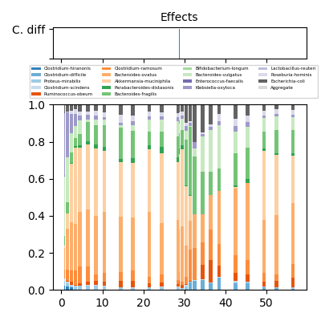
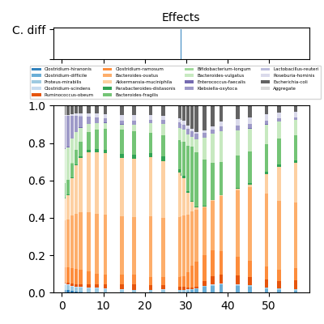
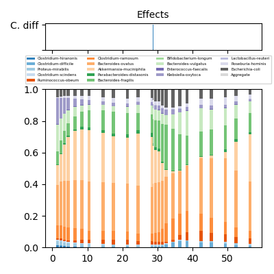

# LUMINATE
LUMINATE (longitudinal microbiome inference and zero detection) includes four programs for inference in longitudinal microbiome datasets:

* `estimate`: estimate relative abundances and posterior probabilities of biological zeros.
* `train`: estimate model parameters for compositional Lotka-Volterra (cLV).
* `predict` (experimental): predict longitudinal trajectories one time point at a time.
* `plot`: generate a stacked bar plot of relative abundances and external effects

## Dependencies
Program dependencies are listed in `requirements.txt`. Install dependencies with `pip install -r requirements.txt`.

## Quick Start
See `./run-examples.sh` to run each program on an example dataset.


## Input

Each program takes as input an OTU Table (taxa by samples) with the following structure:

*  The first row gives IDs for each longitudinal sequence.
*  The second row gives sample times.
*  The first column gives taxon names.

See `datasets/bucci2016mdsine/cdiff-counts.csv` for an example.

A second optional table providing external perturbations can be specified. This is a .csv file where the columns are `sequenceID,eventID,startDay,endDay,magnitude(optional)`

The first column links an event to a longitudinal sample through `sequenceID`. This should correspond to an ID in the OTU Table. The second column gives a name for each event: parameters are inferred for each unique event name.

The start day and stop day give a range of time over which an event occurs (end point included). For example, these could be a range of time when a patient receives antibiotics. For one time events, set `startDay=stopDay.`

The `magnitude` column is used to estimate the parameters of cLV. If unspecified, events are treated like indicator variables: set to 1 during the time of an event and 0 otherwise.

## Worked Example
Here we run through a typical workflow for LUMINATE using the data in `bucci2016mdsine`. First, let's take a look at the data by running

```
python main.py plot \
               datasets/bucci2016mdsine/cdiff-counts.csv \
               -e datasets/bucci2016mdsine/cdiff-events.csv \
               -i datasets/bucci2016mdsine \
               -o datasets/bucci2016mdsine

```
This will produce one stacked bar plot per sequence of relative abundances over time, along with indicators for external events. The top 19 taxa each receive a unique color, while the remaining taxa are aggregated in a single component.

Here is an example, using the first sequence in the C. diff dataset:




### Estimate
Next, we want to estimate relative abundances from sequencing counts, and save the results:

```
python main.py estimate
               datasets/bucci2016mdsine/cdiff-counts.csv \
               -e datasets/bucci2016mdsine/cdiff-events.csv \
               -o datasets/bucci2016mdsine
```

The second position argument specifies the path to the OTU table. The optional argument `-e` (`--effects`) specifies a filepath to the .csv of external events. Finally `-o` (`--outdir`) gives a directory to store results for downstream analysis.

Running `estimate` produces 3 files:

* `cdiff-counts-est.csv` : the estimated relative abundances
* `cdiff-counts-nonzero-posterior-prob.csv`: posterior probabilities of sampling zeros (i.e. a taxon is below the detection threshold as opposed to absent from the community)
* `P.pkl` : a temporary result used for downstream analysis

Let's plot the estimated relative abundances to ensure nothing went wrong:

```
python main.py plot \
               datasets/bucci2016mdsine/cdiff-counts-est.csv \
               -e datasets/bucci2016mdsine/cdiff-events.csv \
               -i datasets/bucci2016mdsine \
               -o datasets/bucci2016mdsine

```




### Train
Next, we want to estimate the parameters of cLV using the estimated relative abundances:

```
python main.py train \
               datasets/bucci2016mdsine/cdiff-counts-est.csv \
               -e datasets/bucci2016mdsine/cdiff-events.csv \
               -i datasets/bucci2016mdsine \
               -o datasets/bucci2016mdsine \
               -b 200
```

The `-i` (`--indir`) flag tells LUMINATE to look in this directory for estimated relative abundances (`P.pkl`). If this is not found, then `estimate` will run by default. The `-o` (`--outdir`) flag tells LUMINATE to save model parameters to this folder. Finally, the `-b` (`--bootstrap`) flag estimates one-sided p-values for model parameters.

This outputs several files

```
	A : the matrix of taxa interactions
	g : relative growth rate vector
	B : effects of external perturbation
	dimensions : the names of each dimension (taxon) in A and g
	effect-dimensions : the names of each column on B
```

Bootstrap one-sided p-values are in `A_pval`, `g_pval`, `B_pval`. These are the estimated probabilities that the nonzero coefficients estimated on the training data have the same sign. For example, if `A_{ij} = 1` the computed p-value is `Prob(A_{ij} > 0)`. Note, the minimum possible p-value is `1/b` so p-values below this threshold will appear as zeros.


### Predict (Experimental)
Finally, if we want to predict trajectories one step at a time we can call

```
python main.py predict \
               datasets/bucci2016mdsine/cdiff-counts-est.csv \
               -e datasets/bucci2016mdsine/cdiff-events.csv \
               -i datasets/bucci2016mdsine \
               -o datasets/bucci2016mdsine \
               --one-step
```

This produces an OTU table of predicted trajectories. Each trajectory is predicted one time point in the future.

Plotting the results:

```
python main.py plot \
               datasets/bucci2016mdsine/cdiff-counts-est.csv \
               -e datasets/bucci2016mdsine/cdiff-events.csv \
               -i datasets/bucci2016mdsine \
               -o datasets/bucci2016mdsine

```




To make a prediction from initial conditions, omit the `--one-step` flag:


```
python main.py predict \
               datasets/bucci2016mdsine/cdiff-counts-est.csv \
               -e datasets/bucci2016mdsine/cdiff-events.csv \
               -i datasets/bucci2016mdsine \
               -o datasets/bucci2016mdsine
```

## Program Options

```
usage: main.py [-h] [-e EVENTS] [-o OUTDIR] [-i INDIR] [-b BOOTSTRAP] [-s]
               command otu-table

Time-series modeling for the microbiome

positional arguments:
  command               Specify analysis to run. One of:
                        train,predict,estimate.
  otu-table             Filepath to OTU table csv.

optional arguments:
  -h, --help            show this help message and exit
  -e EVENTS, --events EVENTS
                        Filepath to table of external events.
  -o OUTDIR, --outdir OUTDIR
                        Specify output directory to store results. Default is
                        current directory.
  -i INDIR, --indir INDIR
                        Specify input directory to load previously computed
                        parameters: typically the OUTDIR from a previous run.
  -b BOOTSTRAP, --bootstrap BOOTSTRAP
                        Perform bootstrap resampling to estimate one-sided
                        p-values of cLV coefficients. The argument specifies
                        the number of bootstrap replicates to perform. Will
                        produce a warning if the sample size is too small
                        (N<30).
  -s, --one-step        Perform one-step prediction instead of prediction from
                        initial conditions.
```